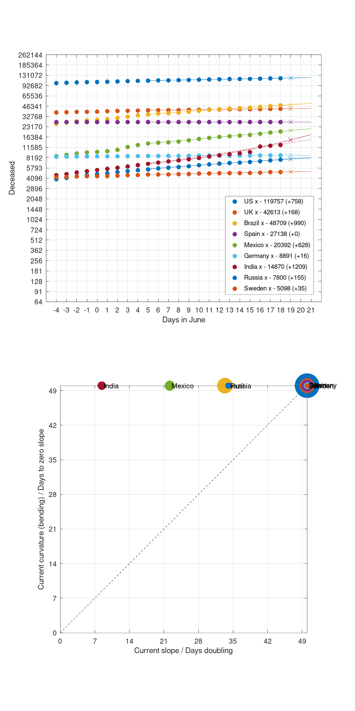

# COVID-19 deceased prediction: Where are we heading?

Deceased people due to coronavirus disease (COVID-19) every day (dots) on a semi-log plot.
Predictions: First degree polynomial (dashed lines), second degree polynomial (solid lines).
The crosses show the predicted numbers for the next day.

Please consult plot_data.m for the details of the fit.
